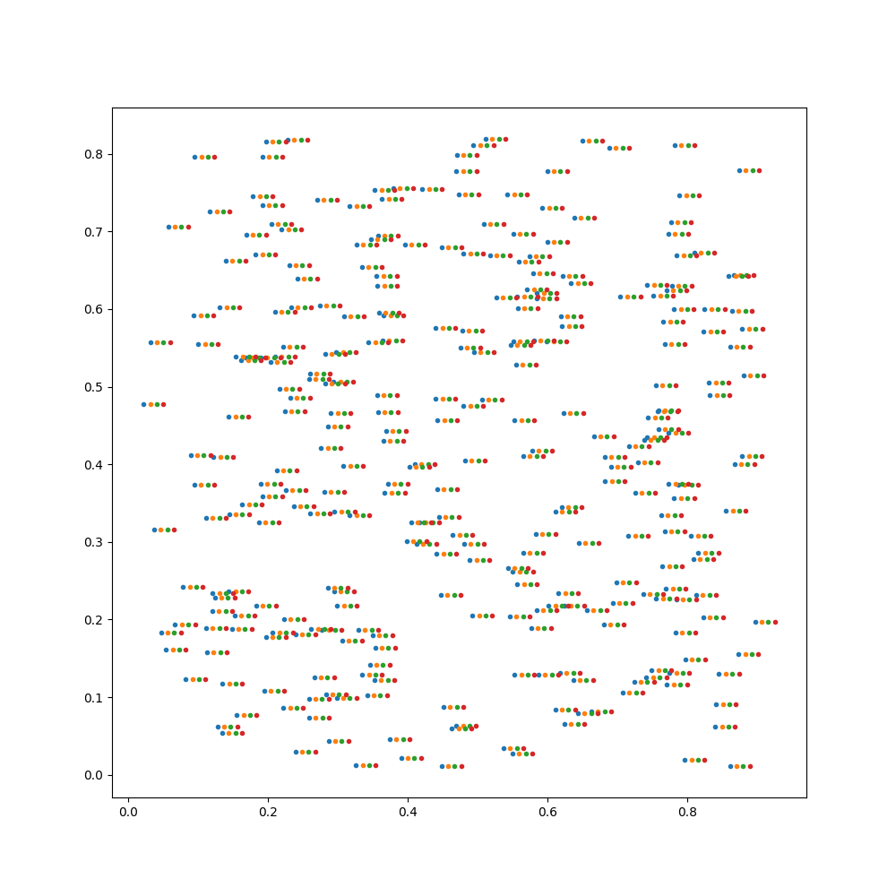

# Deformable attention

---

## DETR (DEtection TRansformer)

This paper is the precursor to Deformable-DETR

Paper: https://arxiv.org/abs/2005.12872  
GitHub:  https://github.com/facebookresearch/detr (see for pretrained models)  
Video: https://www.youtube.com/watch?v=T35ba_VXkMY  
Institute: Facebook AI Research (FAIR)  
Authors: Nicolas Carion, Francisco Massa, Gabriel Synnaeve, Nicolas Usunier, Alexander Kirillov, and Sergey Zagoruyko  
Date: 2020  

<p align="center">
  
</p>

---

## Deformable DETR

DETR + Deformable Attention

Paper: https://arxiv.org/abs/2005.12872  
GitHub: https://github.com/fundamentalvision/Deformable-DETR  
Video: https://www.youtube.com/watch?v=9UG4amweIjk  
Video: https://www.youtube.com/watch?v=3M9mS_3eiaw  

The star of the show is the custom autograd function: MSDeformAttnFunction.apply(). This function is called by the
MSDeformAttn(nn.Module) module's forward(). The MSDeformAttn is used in place of nn.MultiheadAttention.

The recommended environment setup to compile this was outdated, this is what worked for me:   

CUDA Version: 12.2   
Driver Version: 535.183.01  
NVIDIA GeForce RTX 3090

```
conda create -n deformable_detr python=3.10 pip
conda activate deformable_detr
conda install pytorch=2.1.0 torchvision=0.16.0 pytorch-cuda=11.8 -c pytorch -c nvidia
pip install -r requirements.txt
pip install "numpy<2"
# Build Module:
cd ./models/ops
sh ./make.sh
```

<p align="center">
  
</p>

### MSDeformAttnFunction.apply() (Encoder)

In self-attention, we only create Queries and Values.
Queries are projected to predict (4 x (x_offset, y_offset, attention_weight)) relative to a reference point (Queries grid location) on the feature map.
These offset point plus the current reference point are used to interpolate into the Values tensor using bilinear interpolation.
The resulting attention_weight is used to calculate a weighted average, resulting in the output sequence.
This is then passed through the classical Transformer feed-forward network.  

**value:**  
torch.Size([2, 10723, 8, 32])  
(batch_size, num_queries, num_heads, dim_per_head)  
10723 is the sum of all feature vectors on all scales: (10723, 256), the 256 is split up to 8 heads.  
10723=(76×106)+(38×53)+(19×27)+(10×14)
Note that this 10723 changes based on shape of image which changes per batch, this was for (608, 843)  

**value_spatial_shapes:**  
torch.Size([4, 2])  
(num_levels, 2) e.g. [[76, 106], [38, 53], [19, 27], [10, 14]]  
Contains the spatial dimensions (height, width) for each level of the feature maps. Used to reconstruct multi-scale
feature maps from the flattened value tensor.  

**value_level_start_index:**  
torch.Size([4,])
(num_levels,) e.g, [0,  8056, 10070, 10583]  
Specifies the starting index of each level within the flattened value tensor. Enables mapping between value and the
corresponding spatial levels.   

**sampling_locations:**  
torch.Size([2, 10723, 8, 4, 4, 2])  
(batch_size, num_queries, num_heads, num_levels, num_points, 2)  
Specifies the sampling locations (in normalized [x, y] coordinates) for each query across all levels, heads, and points.
Learnable offsets are added to these locations during training to refine the regions of interest.  

**attention_weights:**  
torch.Size([2, 10723, 8, 4, 4])  
(batch_size, num_queries, num_heads, num_levels, num_points)  
Specifies the weights for each sampling location across all heads, levels, and points. These weights are multiplied
with the sampled values to compute the weighted sum.  

**im2col_step:**  
{int} 64  
Splits operations across smaller batch chunks to optimize memory usage and computational efficiency  

**output:**  
torch.Size([2, 10723, 256])  
256 = 8 * 32 = num_heads * dim_per_head  
(batch_size, num_queries, embed_dim)  

### MSDeformAttnFunction.apply() (Decoder)

In cross-attention, we only create Queries and Values.
300 pseudo Queries are projected to predict (4 x (x_offset, y_offset, attention_weight)).
Since in this case, the Queries don't have a reference location, so they seem to be initialized via uniform distribution. 
They are learnable parameters of size torch.Size([b, 300, 2]). 
The offsets to these are of size torch.Size([b, 300, 4, 2]), where 4 is the number of feature scales.
This is then turned into the sampling_locations of size torch.Size([2, 300, 8, 4, 4, 2]).

Some things change in the decoder, mainly, there are only a hardcoded set of 300 queries (300 potential object
detections)

**value (memory):**  
torch.Size([2, 10723, 8, 32])

**sampling_locations:**  
torch.Size([2, 300, 8, 4, 4, 2])

**attention_weights:**  
torch.Size([2, 300, 8, 4, 4])

**output:**  
torch.Size([2, 300, 256])

```
output = MSDeformAttnFunction.apply(value, value_spatial_shapes, value_level_start_index, sampling_locations, attention_weights, im2col_step)
```

<p align="center">
  
</p>

<p align="center">
  
  
</p>
<p align="center">
  Left: iter 1, Right: iter 30k, Offset coodiantes for head 0, scale 0 before and after some training
</p>

<p align="center">
  
  
  
</p>
<p align="center">
  Left: Heads, Center: Scales, Right: Offsets
</p>

---

## DAT (Deformable Attention Transformer)

Implements multiple types of attentions: NeighborhoodAttention2D, FusedKQnA, SlideAttention  

Paper: https://arxiv.org/abs/2201.00520  
GitHub: https://github.com/LeapLabTHU/DAT  

Uses a version of deformable attention called Neighborhood Attention implemented in the NATTEN library.  
NATTEN: https://pypi.org/project/natten/  

```
from natten.functional import NATTEN2DQKRPBFunction, NATTEN2DAVFunction
```

NATTEN2DQKRPBFunction: Neighborhood Attention 2D Query-Key Relative Position Bias Function  
NATTEN2DAVFunction: Neighborhood Attention 2D Attention Values Function

---

## DAT++

Paper: https://arxiv.org/abs/2309.01430  

---

## DAB

---

## DINO

---

## co-DETR

---