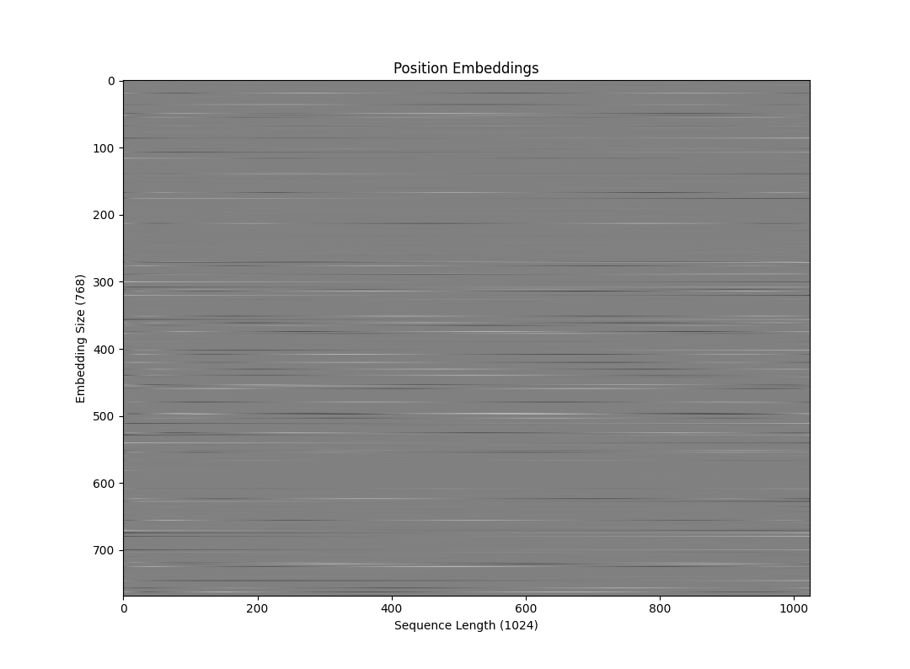
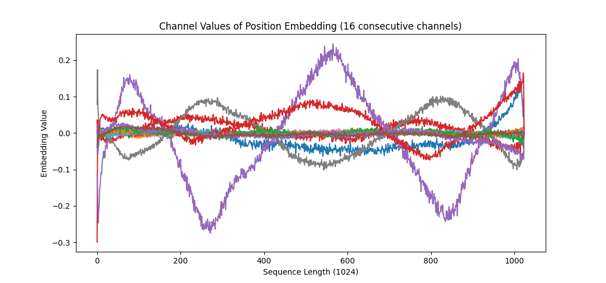
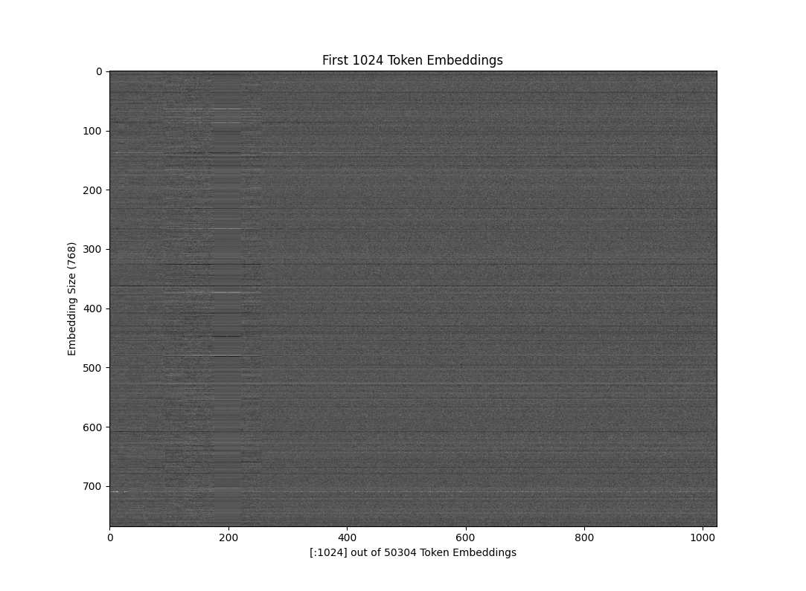

# GPT 2
A truncated version of Karapthy's work, this repository gets GPT-2 weights from hugging-face, loads them into a
minimalistic computational graph defined in pytorch, then runs autoregressive sampling based on some initialization
string

Source: https://github.com/karpathy/nanoGPT  
Video: https://www.youtube.com/watch?v=l8pRSuU81PU

### Execution

Inference:
```
python sample.py
```

---

# Notable Points

* Tokenization done by tiktoken library: https://tiktokenizer.vercel.app/?model=gpt2
* <|endoftext|> as a special token
* Use of Flash Attention CUDA kernels: torch.nn.functional.scaled_dot_product_attention() (pytorch 2.0)
* By default, nn.Linear and nn.Embedding is initialized with: torch.nn.init.normal_(module.weight, mean=0.0, std=0.02)
* Use of nn.GELU() in feed-forward

---

# Visualization

### Attention Masks During inference

Visualization of the n-th head of the first 4 layers for a range of 256 using the <|endoftext|> as the initial token.  


### Positional Embeddings

| Mean    | Std    | Min     | Max    |
|---------|--------|---------|--------|
| -0.0007 | 0.1227 | -4.5381 | 4.0653 |


Sigmoid applied before plotting. Note that the nn.Embedding is just a 2-D tensor, that provided a mapping between a
column id and a vector. Calling the forward() for torch.arange(0, 1024) and embedding.weight returns the same tensor.
Tempting to think of enforcing some constraint, such that the learned embeddings are always of unit length.

<p align="center">
  
</p>

<p align="center">
  
</p>

### Token Embeddings

There is a clear pattern of similar emveddings in the range of [177-219]. Based on the [GPT-2 encoder.json][reference],
these values represent the following UTF16 characters.

[reference]: https://github.com/graykode/gpt-2-Pytorch/blob/master/GPT2/encoder.json
```
"\u00f5": 177, "\u00f6": 178, "\u00f7": 179, "\u00f8": 180, "\u00f9": 181, "\u00fa": 182, "\u00fb": 183, "\u00fc": 184, "\u00fd": 185, "\u00fe": 186, "\u00ff": 187, "\u0100": 188, "\u0101": 189, "\u0102": 190, "\u0103": 191, "\u0104": 192, "\u0105": 193, "\u0106": 194, "\u0107": 195, "\u0108": 196, "\u0109": 197, "\u010a": 198, "\u010b": 199, "\u010c": 200, "\u010d": 201, "\u010e": 202, "\u010f": 203, "\u0110": 204, "\u0111": 205, "\u0112": 206, "\u0113": 207, "\u0114": 208, "\u0115": 209, "\u0116": 210, "\u0117": 211, "\u0118": 212, "\u0119": 213, "\u011a": 214, "\u011b": 215, "\u011c": 216, "\u011d": 217, "\u011e": 218, "\u011f": 219,
```

Decoding them using a UTF16 decoder results in the following characters. Assumption is that these characters are
under-represented in the training dataset, resulting in relatively similar looking token embeddings.

```
õ, ö, ÷, ø, ù, ú, û, ü, ý, þ, ÿ, Ā, ā, Ă, ă, Ą, ą, Ć, ć, Ĉ, ĉ, Ċ, ċ, Č, č, Ď, ď, Đ, đ, Ē, ē, Ĕ, ĕ, Ė, ė, Ę, ę, Ě, ě, Ĝ, ĝ, Ğ, ğ
```

<p align="center">
  
</p>


---

# Example of Generated Text 

Using <|endoftext|> for initialization plus generation of 500 tokens:

```
<|endoftext|>'No-one's Doing Anything' - Media Matters' Ian Jacobson on the documentary 'No-one's Doing Anything'

The film follows political activist Andrew Bolt, who faces charges of defamation for writing a piece on the London Olympics and then later disappearing into the Arctic. The campaign focuses on the fact that the UK has so far not been able to conduct its own investigation into the climate change denial projects.

Both the Herald and BBC have received our own FOIA requests, which include a series of original documents taken from Dr. Andrew Bolt's laptop, which have been provided to them by the US government.

Gavin Merck, a spokesman for the Department of Homeland Security who is handling the case for the UK, told The Guardian, "The evidence provided by the FBI and the NSA was overwhelming. They have brought charges against dozens of other individuals. We believe that the US government should be allowed to do its own internal investigation into the truth of the 'activities' with which Dr. Bolt and others called attention."

The documentary focuses on the project, which aims to raise awareness of extreme climate change in the United States, which was launched by former President Barack Obama and has seen its funding suspended.

According to the Mercury, Bolt took off from his North Dakota vacation shortly after the Olympic Games closed.

The documentary is said to be set in New York City and focuses on a number of locations, some of which may not have made the cut.

The documentary will be shot in 2012.<|endoftext|>The CBA, by and large, is an agreement between the federal government, the states, and private sector that enables industries to obtain a share of state revenues at a price that is fair and competitive to the individual economy. The CBA has the power to compel businesses to offer as many concessions as they can to ensure local economies and jobs are provided to all the people who use them. The CBA also allows companies to continue to give up state revenues, and government agencies across the country are required to comply with the law. The CBA was passed by the General Assembly in April of 2007 under the authority of the CBA Act in conjunction with a bill to revise the NC Referendum Act to allow up to 60% of the sales of gas tax dollars for the state to come from the state governments.


The CBA provides that state governments and businesses are required to maintain reasonable administrative, financial, and administrative controls over the
```