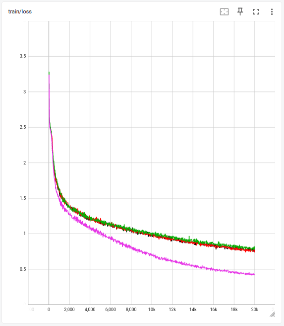
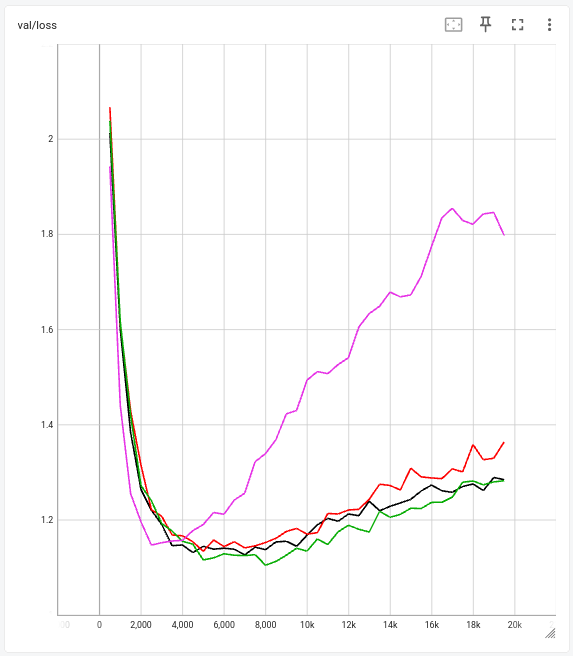

# Language Prediction
Benchmarking Andrey Karpathy's language prediction implementation against the official pytorch nn.TransformerEncoder
(Decoder) and 3rd party implementation.  

Credit: https://github.com/karpathy/ng-video-lecture

---

### Execution
Download Data:
```
wget https://raw.githubusercontent.com/karpathy/char-rnn/master/data/tinyshakespeare/input.txt
```

Tensorboard:
```
tensorboard --logdir outputs
```

Train:
```
python train.py
```

---

### Model Details

vocab_size: 65 (dynamically calculated based on unique chars)  
nhead: 6  
num_layers: 6  
d_model: 384  
d_ff: 1536  
seq_len: 256  
dropout: 0.2  
batch_first: True  
norm_first: True  

|                  | Parameters |
|------------------|------------|
| official         | 10,795,841 |
| karpathy         | 10,788,929 |
| karpathy (fixed) | 10,788,929 |
| third_party      | 10,795,841 |
| einops           | 10,788,929 |

---

### Results

Andrey Karpathy's original implementation is missing dropout layers applied to the Self-Attention and Feed-Forward
blocks. Following this fix, the training and validation losses of these implementations are very close. The experiments
were run for 20k iterations compared to Karpathy's 5k. This was done to find the starting point and severity of the
overfit.

<div style="display: flex; justify-content: center; align-items: center; gap: 20px; flex-wrap: nowrap;">
  <div style="text-align: center;">
    
  </div>
  <div style="text-align: center;">
    
  </div>
</div>
<p align="center">
  Black: official, Green: third_party, Purple: karpathy, Red: karpathy (fixed)
</p>


---

### Network Output
#### Output of the best validation checkpoint (3rd Party at 8k iterations):

PERDITA:  
O, wrantle said, The harlot should make pame,  
In whose stock'd days it so in it:  
And seem something stays more strongs much there,  
By this the loss calrenge tyranness: what I  
Stabby a slain?  
Till then be thou false attainst thy hands  
Were a honour and no old Christs Plandon.  

OXFORK:  
Bring forth happy those that never, you might,  
God says it for just welling what I am yet.  

SLY:  
O, like your heats to undergo touch O!  

JOHN OF GAUNT:  
Pity me! pilgrings Burgey, unto thy divilgrity.  
