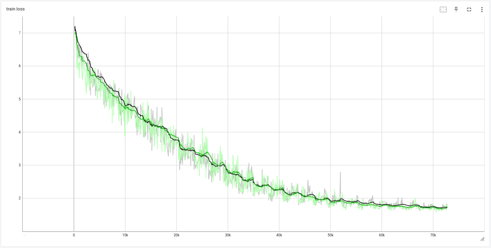
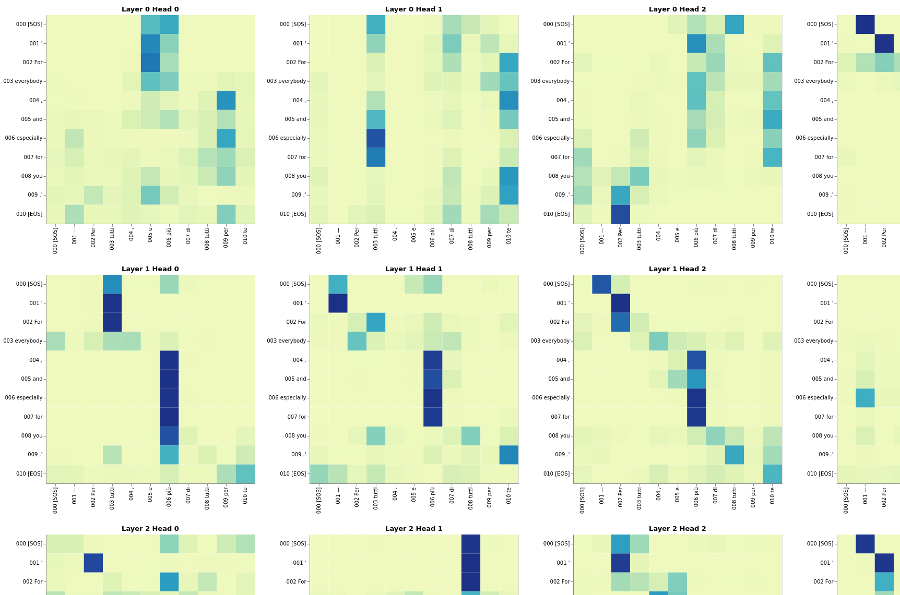
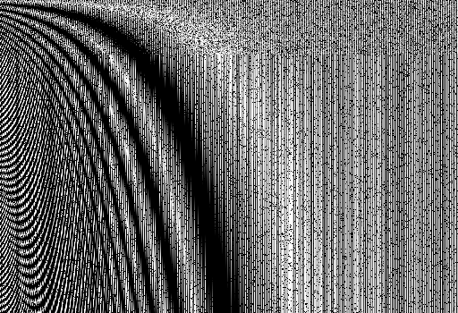
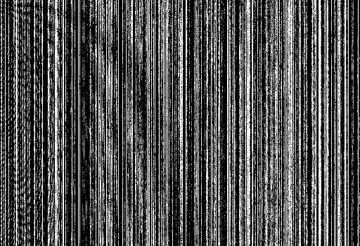
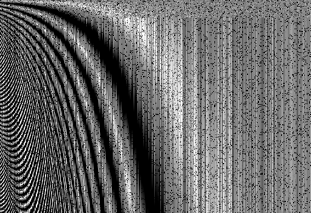

# Language Translation
Benchmarking a from scratch implementation against the official pytorch Transformer  
Credit: https://github.com/hkproj/pytorch-transformer

---

### Execution
Tensorboard:
```
tensorboard --logdir outputs
```

Train:
```
python train.py
```

Evaluation:
```
python evaluation.py
```

Attention Visualization:
```
python attention_visualization.py
```

---

### Results

High similarity in training loss, reasonable to conclude that the custom implementation is correct.
During experimantation, it was found that the model is very sensitive to parameter initialization.
These results were achieved by using xavier_uniform only for the src and tgt nn.Embedding().

<p align="center">
  
</p>
<p align="center">
  Black: official.py, Green: custom.py (it-en for 25 epoches with a batch size of 10)
</p>

<p align="center">
  
</p>
<p align="center">
  Cross-Attention between Encoder Key, Value and Decoder Query for Heads and Layers
</p>

---

### Images

<p align="center">
  
</p>
<p align="center">
  Batch element [1] of encoder src (after embedding, positional encoding and dropout). Size(b, 350, 512).
</p>

<p align="center">
  
</p>
<p align="center">
  Encoder src_key_padding_mask. Size(b, 350). Padded sections are True (white).
</p>

<p align="center">
  
</p>
<p align="center">
  Encoder output (memory). Size(b, 350, 512).
</p>

<p align="center">
  
</p>
<p align="center">
  Batch element [1] of decoder src (after embedding, positional encoding and dropout). Size(b, 350, 512).
</p>

<p align="center">
  
</p>
<p align="center">
  Decoder tgt_key_padding_mask. Padded sections are True (white). Size(b, 350).
</p>

<p align="center">
  
</p>
<p align="center">
  Decoder memory_key_padding_mask (same as src_key_padding_mask). Padded sections are True (white). Size(b, 350).
</p>

<p align="center">
  
</p>
<p align="center">
  Decoder tgt_mask (causal mask). Padded sections are True (white). Size(350, 350).
</p>

---


